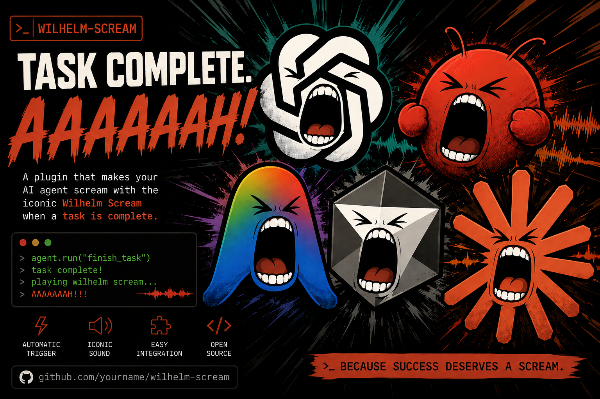
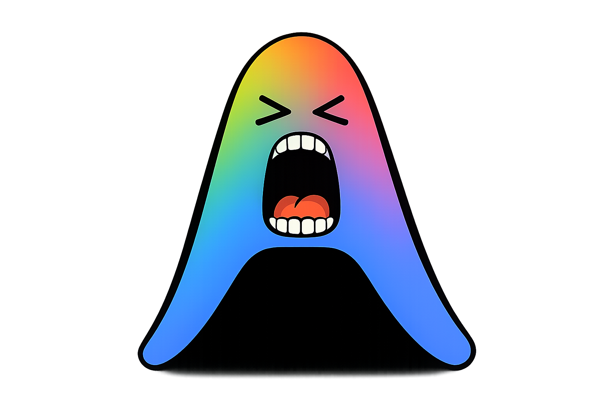
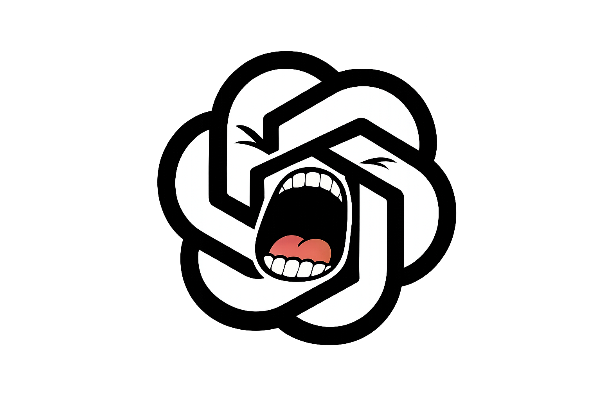
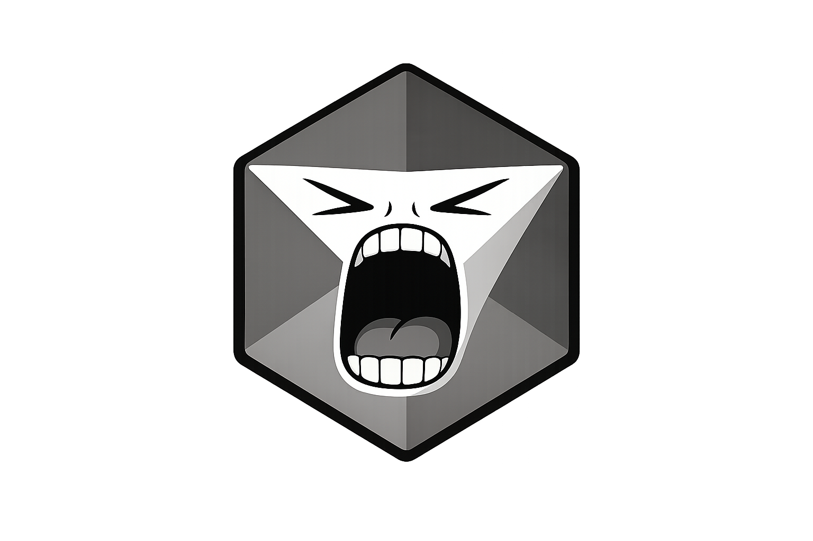

# wilhelm-alert



Your agent finishes a task. It screams. You look up.

That's it. That's the plugin.

It's the [Wilhelm scream](https://en.wikipedia.org/wiki/Wilhelm_scream) —
the stock sound effect that's been in a few hundred movies — fired from
your coding agent's "task complete" hook.

**Agents:** Claude Code and Codex install as real plugins. Cursor,
Antigravity, and OpenClaw wire up by hand — see
[Install it into your agent](#install-it-into-your-agent).

<table>
  <tr>
    <td align="center" bgcolor="#111111"></td>
    <td align="center" bgcolor="#111111"></td>
    <td align="center" bgcolor="#111111"></td>
    <td align="center" bgcolor="#111111"></td>
    <td align="center" bgcolor="#111111"></td>
  </tr>
  <tr>
    <td align="center">OpenClaw</td>
    <td align="center">Antigravity</td>
    <td align="center">Claude Code</td>
    <td align="center">Codex</td>
    <td align="center">Cursor</td>
  </tr>
</table>

The faces are transparent PNGs, so each agent can keep its own character
while sharing the same popup behavior.

**Platforms:**

| | Sound | Overlay | Shake | Mini app |
| --- | --- | --- | --- | --- |
| macOS | ✅ | ✅ | ✅ | ✅ |
| Windows | ✅ | ✅ | ✅ | ❌ edit the config file |
| Linux | ✅ | ⚠️ needs python3-tk | ⚠️ same | ❌ edit the config file |

The core is Node, so all three behave the same. The overlay is native per
platform: Swift on macOS, WPF on Windows, Tk on Linux. Only macOS gets the
mini app.

## Modes

| Mode | What happens |
| --- | --- |
| `light` | Just the scream. Tasteful. Restrained. Cowardly. |
| `middle` | The scream, plus a popup of the model itself screaming at you. |
| `turbo` | The scream, the popup, and the popup shakes like it's being attacked. |

Set it in the app (`pnpm app`), or in `~/.config/wilhelm-alert/config`.

The face that pops up matches whichever agent called it — named
`scream-<source>` faces are resolved automatically, so OpenClaw, Antigravity,
Claude Code, Codex, and Cursor can each have a distinct scream.

The popup is a small borderless overlay in the corner of the screen. It
doesn't steal focus, so it can't eat the keystroke you were mid-way through
typing, and clicking it dismisses it early.

## Setup

```bash
git clone https://github.com/MaxJafar/wilhelm-alert.git
cd wilhelm-alert
pnpm install
pnpm app
```

`pnpm app` installs **Wilhelm Alert.app** into `~/Applications` and opens it.
After that it's in Spotlight — ⌘-space, "wilhelm" — so you never need to come
back to this folder. Pick your mode, hit **Test it** to hear it, and install
into your agents with a button. No browser, no localhost, no menu bar clutter.

Don't want the app in `~/Applications`? `pnpm panel` opens the same window
straight from the repo.

Prefer the terminal? The mode lives in `~/.config/wilhelm-alert/config`:

```bash
mkdir -p ~/.config/wilhelm-alert && echo 'mode=turbo' > ~/.config/wilhelm-alert/config
```

Use the config file rather than an `export` in your shell profile — hooks
run inside the *agent's* environment, so a variable you set in your terminal
usually never reaches them. `WILHELM_ALERT_MODE` still overrides everything
for one-off tests.

Either way, add a sound file if you want the full effect:

**A scream.** No audio ships with this repo — the Wilhelm scream is a
copyrighted sound effect. Grab one ([BigSoundBank](https://bigsoundbank.com/wilhelm-scream-s0477.html)
has a free download) and drop it at `sounds/wilhelm-scream.wav` (`.mp3`/`.aiff`
work too). See [sounds/README.md](sounds/README.md).

If you installed as a plugin, put the **absolute path** in your config
instead:

```
sound=/full/path/to/wilhelm-scream.wav
```

Agents run a *copy* of this folder, and `sounds/` is gitignored — so a copy
made from GitHub has no audio in it, and a relative lookup finds nothing. An
absolute path is immune to which copy is running.

The repository includes default faces for OpenClaw, Antigravity, Claude Code,
Codex, and Cursor for `middle` and `turbo`. To replace one, copy an image to
your clipboard and run:

```bash
./bin/wilhelm-face claude    # then again with: codex
```

It saves to `assets/scream-<name>.png` and shrinks anything oversized. You
can also drop files in [assets/](assets/README.md) by hand.

Then check it works:

```bash
WILHELM_ALERT_MODE=turbo ./bin/wilhelm-alert
```

## Install it into your agent

`pnpm app` does this with a button. By hand:

### Claude Code

```bash
claude plugin marketplace add MaxJafar/wilhelm-alert
claude plugin install wilhelm-alert@wilhelm-alert-marketplace
```

### Codex CLI

```bash
codex plugin marketplace add https://github.com/MaxJafar/wilhelm-alert
codex plugin add wilhelm-alert@wilhelm-alert-marketplace
```

**Then start `codex` interactively once and approve the hook when it asks.**
Codex won't run any plugin hook until you've reviewed it, and it doesn't
warn you that it's skipping one — the plugin looks installed and enabled and
simply never fires. `codex exec` can't prompt, so it always skips unreviewed
hooks.

Changing `hooks/hooks.json` invalidates that approval, because the trust is
recorded as a hash of the hook — so a plugin update means approving again.
For automation that already vets its plugins, `codex exec
--dangerously-bypass-hook-trust` skips the gate.

Working from a local clone instead? Point them at the folder — `claude
plugin marketplace add ./` and `codex plugin marketplace add .`.

**After changing anything** — a new sound, new faces, edited code — run
`claude plugin update wilhelm-alert@wilhelm-alert-marketplace`. Agents run
a *copied* snapshot of this folder, pinned by the version in `plugin.json`,
so edits are invisible to them until you bump the version and update. This
is the single most confusing thing about the whole project.

Both hook `Stop` — and only `Stop` — via
[hooks/hooks.json](hooks/hooks.json). One hook file serves both, because
Codex helpfully sets `CLAUDE_PLUGIN_ROOT` for plugin compatibility.

### Cursor

`pnpm app` has a button for this, which merges into your existing
`~/.cursor/hooks.json` rather than overwriting it. By hand, see
[integrations/cursor/](integrations/cursor/README.md). Hook the `stop`
event, not `afterAgentResponse` — the latter fires after every assistant
message, so a long task screams at you repeatedly.

### Antigravity

No plugin format to hook into yet, so do it by hand: drop
[integrations/antigravity/hooks.json](integrations/antigravity/hooks.json)
into `.agents/` in your workspace or `~/.gemini/config/`, with the path
filled in.

### OpenClaw

[integrations/openclaw/](integrations/openclaw/). OpenClaw has no "task
finished" event at all — only `command:stop` when you manually type `/stop`.
But its `coding-agent` skill runs Codex or Claude Code as the actual worker,
so installing the plugin above already makes it scream. Problem solved by
someone else's architecture.

## Why did it just scream?

Every hook run is logged — the ones that screamed and the ones that were
deliberately suppressed:

```bash
pnpm log              # last 25
pnpm log --skipped    # only the suppressed ones
pnpm log --all
```

```
Aug 04, 12:39:06 AM  🔊 SCREAMED  end of turn
                     source=claude  event=Stop  model=claude-sonnet-5  session=eee55555
Aug 04, 12:38:44 AM  ·  skipped   ignored SessionEnd (resume)
                     source=claude  event=SessionEnd  session=aaa11111
```

It only fires on a genuine end of turn. Three things get suppressed:

- **Session lifecycle events.** `SessionEnd` is teardown, not completion —
  it fires with `reason: resume` when another instance takes the session
  over, and with `clear` when you clear it. Hooking it meant screaming when
  you merely launched the app or opened a link.
- **Re-entrant stops**, where the agent reports a stop while a stop hook is
  already running.
- **Anything within 3s of the last scream**, so two hooks landing together
  can't stack. Tune with `min_interval_ms=` in your config.

`--force` bypasses all of it, for testing.

## Things that will go wrong

**It worked when I ran it, but the agent stays silent.** Either you changed
the repo without bumping + updating the plugin, or the plugin copy has no
audio in it because `sounds/` is gitignored. Put an absolute `sound=` path
in your config — see [Setup](#setup).

**Nothing happens at all.** You didn't add a sound file. See above.

**It screams at the wrong times.** Check `pnpm log` first — if you see
`SessionEnd` entries actually firing, you're on a version before 0.5.0 and
the plugin copy still has the old hook. Bump and update.

**Codex says installed and enabled, but never screams.** You haven't
approved the hook. `codex plugin list` will happily report `installed,
enabled` while Codex skips the hook entirely, and `pnpm log` stays empty
because the script is never run. Start `codex` interactively and approve the
hook review. See [Codex CLI](#codex-cli) above.

**No overlay on macOS, just the scream.** The overlay is a tiny Swift
program built on first use, so it needs Xcode command line tools
(`xcode-select --install`). First build takes ~2s, then it's cached in
`~/.cache/wilhelm-alert`.

**No overlay on Linux.** Tk isn't installed. `sudo apt install python3-tk`
(or your distro's equivalent), and `pip install Pillow` if your face is a
PNG — bare Tk only reads GIF.

**The popup shows the wrong agent's face.** Claude Code and Codex are
detected automatically; everything else has to announce itself with
`--source cursor` in the hook command. Without a matching
`assets/scream-<source>.png` it falls back to whatever face it can find,
which is deliberately not "nothing at all".

The turbo shake used to need Accessibility permission, back when it rattled
a Quick Look window that belonged to someone else. The overlay owns its own
window now, so it shakes itself and asks you for nothing.

Every failure path exits 0 on purpose. A joke plugin that breaks your
agent's hook chain is no longer a joke, it's a bug report.

## Trademarks, since this is public

The popup images are parody artwork, and the fun ones are inevitably going to
be somebody's logo with a mouth drawn on it. That's parody, and parody of a
logo is not the same as a license to use it — this project doesn't claim any
rights to Anthropic's, OpenAI's, or anyone else's marks, isn't affiliated with
or endorsed by them, and ships no official brand assets. Draw what you like on
your own machine; think twice before committing it to a public repo with
someone's brand on it.

## License

[Apache-2.0](LICENSE). It's a pet project that makes a computer scream —
take it, fork it, make it worse.
